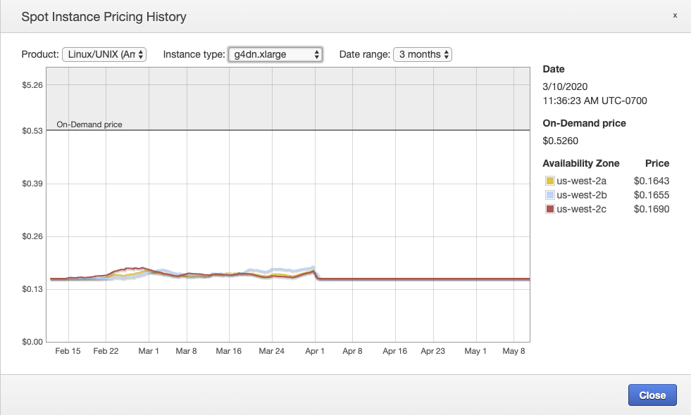
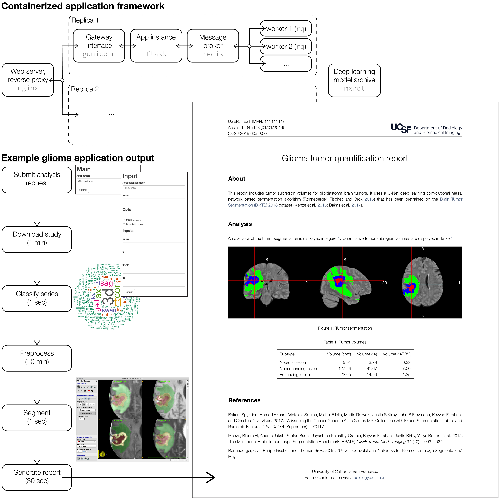
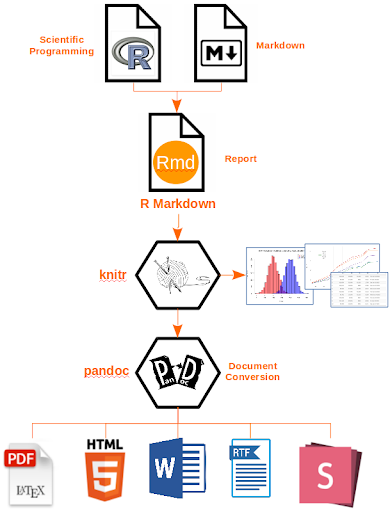
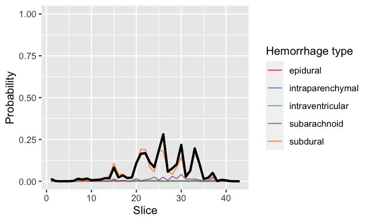

# Video presentation

.middle[.center[
<iframe src="https://player.vimeo.com/video/419503226" width="720" height="480" frameborder="0" allow="autoplay; fullscreen" allowfullscreen></iframe>
]]

---
# More info

```{r xaringan-logo, echo=FALSE}
xaringanExtra::use_logo(
  image_url = "img/logo.png",
  link_url = 'https://radiology.ucsf.edu',
  position = xaringanExtra::css_position(bottom = "-1.5em", right = "1em")
)
```

- Slides: [johncolby.github.io/asnr2020](https://johncolby.github.io/asnr2020)
- Repo: [github.com/johncolby/asnr2020](https://github.com/johncolby/asnr2020)

???
- We're going to talk about some engineering work we've done to put together a nice simple pipeline for medical image analysis on our clinical PACS here at UCSF.
- I hope to convince you that, if you aren't already doing this, the barrier for entry is pretty low, and you should give it a shot.
- These presentation slides are available verbatim on github, as well as the underlying repository.

---
.pull-left[
# Rationale
- Algorithms are free.
]

.pull-right[.middle-img[
```{r echo=FALSE, out.width="100%"}

```
]]

???
- The rationale for putting a pipeline like this together is several fold...
- SOTA general purpose computer vision algorithms included within DL toolkit model zoos.
- Many more application specific methods also released nearly in real time.
- And even if we didn't have access to SOTA, many biomedical imaging applications are already more limited by basic limitations in terms of SNR. (garbage in garbage out; e.g. tumor progression vs radionecrosis, or a subtle indeterminate single slice finding at NCHCT)

---
.pull-left[
# Rationale
- Algorithms are free.
- Computers are cheap.
]

.pull-right[.middle-img[
```{r echo=FALSE, out.width="100%"}

```
]]

???
- NVIDIA DGX-2 = 16 v100 GPU = ~500k
- v100 instances w/ 8 GPU, 32 GB VRAM each = $9.30/hr → can rent 16 for $19/hr
- T4 = ~1/2 v100 compute performance → can rent 32 AWS EC2 instances for ~$5/hr

---
.pull-left[
# Rationale
- Algorithms are free.
- Computers are cheap.
- Data are *expensive*. 
]

.pull-right[.middle-img[
```{r echo=FALSE, out.width="100%"}
knitr::include_graphics('img/Radiologist_interpreting_MRI.jpg')
```
]]

???
- As radiologists, in this space, we're in the business of data generation.
- Given our stewardship over the most valuable piece of the pie, it really makes for a compelling argument that we should take on a leadership role in putting these pieces together.
- 4 + 4 + (4) + 1 + 4 + 1 = yrs in radiology training.
- Scanner time is valuable.
- Expert annotation is painful = `$$$`.

---
# Overview
.center[.middle-img[
```{r echo=FALSE, out.width="50%"}

```
]]

???
- Here is a rundown of what we've put together.
- Within a containerized web app framework, we abstract some of the processing stages that are common to many different applications, which then allows us to more easily create different app plugins for analyses (Tumor, heme, simple volumetric descriptive stats, mets, etc.)

---
# Extensible application framework
- [`johncolby/rad_apps`](https://github.com/johncolby/rad_apps)
- Simple web frontend.
- API for submitting analysis requests.
- Docker/swarm for scalability and redundancy.
- Can extend base application plugin template for different uses.

```{r echo=FALSE, out.width="90%"}

```

???
- When you hit the entrypoint, you will get handed off transparently to one of these redundant app servers, which will then package up your request and fire off your job to one of these back end workers. 
- Using docker, these micro-services can be deployed in disposable containers.
- Using the docker swarm container orchestration tool, can manage services with load balancing and redundancy.

---
# Wrangle data
- [`johncolby/dcmclass`](https://github.com/johncolby/dcmclass): R package for classifying series from DICOM header metadata (study description, TR, TE, scanner code, etc.)

.pull-left[.center[
```{r echo=FALSE, out.width="80%", fig.cap="T1, T2, T1 post, FLAIR"}

```
]]
.pull-right[.center[
```{r echo=FALSE, out.width="80%", fig.cap="other series"}
knitr::include_graphics('img/wordclouds_other.png')
```
]]

???
- Like any analysis, the up front data wrangling is often a larger and more annoying task than one would hope.
- Different scanners = different conventions, different techs = operator variability.
- There are many different ways to solve this. We've put together an R package for classifying series of interest by fitting an ensemble of machine learning models to a representative sample of DICOM header metadata.

---
.pull-left[
# Preprocessing
- Can be trivial (straight DICOMs).
- More complex analyses need more complex preprocessing.
- E.g. multichannel tumor segmentation.
- Mature pipelining tools already exist in the neuroimaging community: [`nipype`](https://github.com/nipy/nipype)
]

.pull-right[.middle-img[
```{r echo=FALSE, out.width="100%"}

```
]]

???
- Trivial = chest radiographic, 2D axial image slices (still need to WL)
- Complex = Skull strip T1, register to template space. Register other modalities to T1, concatenate transformations, bring all into template space, final skull strip, bias field correct, reslice, etc..
- We're lucky in the neuroimaging community to have some really good tools for doing this type of pipelining. 

---
# Deep learning inference
- Many modern workflows use DL models, and can benefit from GPUs.
- Can make sense to split off from the rest of processing.
- [`awslabs/multi-model-server`](https://github.com/awslabs/multi-model-server)
  - Containerized, scalable, DL model server.
  - [*A flexible and easy to use tool for serving deep learning models trained using any ML/DL framework.*]
  - Open Neural Network Exchange (ONNX): Compatability between torch, mxnet, tensorflow, etc.

???
- An increasing number of applications nowadays are all going to converge on needing to do some type of deep learning inference. In some use cases you can get away with doing this on CPU, however in others it can very useful to still offload the inference step to GPU.
- Here we us this really nice `mms` tool from Amazon AWS Labs, which again is containerized and scalable, and will let us host a whole *library* of different deep learning models.

---
.pull-left[
# Report
- R Markdown.
- Reproducible, dynamic, analysis reports.
- Mix prose, stats, visualization.
- Can output to web, PDF, others

.center[
```{r echo = FALSE, out.width="53%"}

```
]
]

.pull-right[
```{r echo=FALSE, out.width="100%"}

```
]

???
- Many ways to report...email, SMS, json upload.
- PDF a useful lowest common denominator.

---
# Example: Hemorrhage detection at noncontrast CT
.pull-left[
- [RSNA Intracranial Hemorrhage Detection challenge](https://kaggle.com/c/rsna-intracranial-hemorrhage-detection)
- Hemorrhage ∈ [none, any, epidural, intraparenchymal, intraventricular, subarachnoid, subdural]
- 2D CNN deep learning model [`johncolby/rsna_heme`](https://github.com/johncolby/rsna_heme)
]

.pull-right[.video-container[
<iframe src="https://player.vimeo.com/video/417311798" frameborder="0" allow="autoplay; fullscreen" allowfullscreen></iframe>
]]

???
- With that, I just want to demo the type of app you could put together with these tools.
- 674258 unique images
- 19530 unique studies
- 17079 unique patients
- 2D slice-wise computer vision approach, 3 WL combos as 3 channels in 8 bit JPEG.
- CNN predicts presence of heme and its subtype.

---
# Negative 1
.middle-img[
```{r echo=FALSE, out.width="70%"}

```
].pull-right[.middle-img[
```{r echo=FALSE, out.height="500", out.width=""}

```
]]

---
# Negative 2
.middle-img[
```{r echo=FALSE, out.width="70%"}

```
].pull-right[.middle-img[
```{r echo=FALSE, out.height="500", out.width=""}

```
]]

---
# Negative 3
.middle-img[
```{r echo=FALSE, out.width="70%"}

```
].pull-right[.middle-img[
```{r echo=FALSE, out.height="500", out.width=""}

```
]]

???
These are the type of clearly negative cases that, with a little internal validation and ROC analysis, you may be able to triage away from needing any human input overnight (at least wrt heme).

---
# Subdural
.middle-img[
```{r echo=FALSE, out.width="70%"}

```
].pull-right[.middle-img[
```{r echo=FALSE, out.height="500", out.width=""}

```
]]

---
# IVH
.middle-img[
```{r echo=FALSE, out.width="70%"}

```
].pull-right[.middle-img[
```{r echo=FALSE, out.height="500", out.width=""}

```
]]

---
# Atrophy
.middle-img[
```{r echo=FALSE, out.width="70%"}

```
].pull-right[.middle-img[
```{r echo=FALSE, out.height="500", out.width=""}

```
]]

???
I put this here for fun to remind us that even though these deep learning feature extractors are trained to cue on hemorrhage, they may also sparkle in other situations - here of course on the prominent extra axial spaces in this elderly individual.

---
# Post-op
.middle-img[
```{r echo=FALSE, out.width="70%"}
knitr::include_graphics('img/heme_postop.png')
```
].pull-right[.middle-img[
```{r echo=FALSE, out.height="500", out.width=""}

```
]]

---
# Live app server

<iframe src="http://localhost:5001" class="app"></iframe>

???
Small viewport on one of these app servers running right now.

---
# Overview
.center[.middle-img[
```{r echo=FALSE, out.width="50%"}

```
]]

???
Using available data (the most valuable resource), open source tools, and off the shelf hardware, one can create a robust end-to-end analysis pipeline on a clinical PACS.

---
class: inverse, middle, center

# Thanks!

###Jeffrey Rudie MD PhD, Andreas Rauschecker MD PhD, Leo Sugrue MD PhD, Janine Lupo PhD, Jason Crane PhD, Christopher Hess MD PhD, Javier Villanueva-Meyer MD
